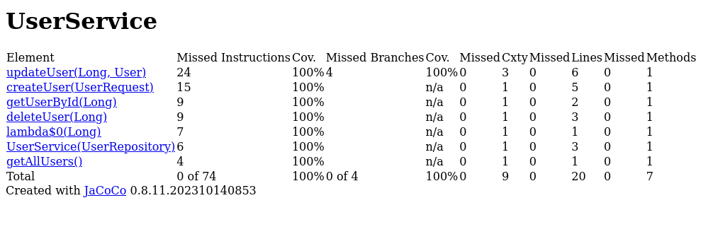
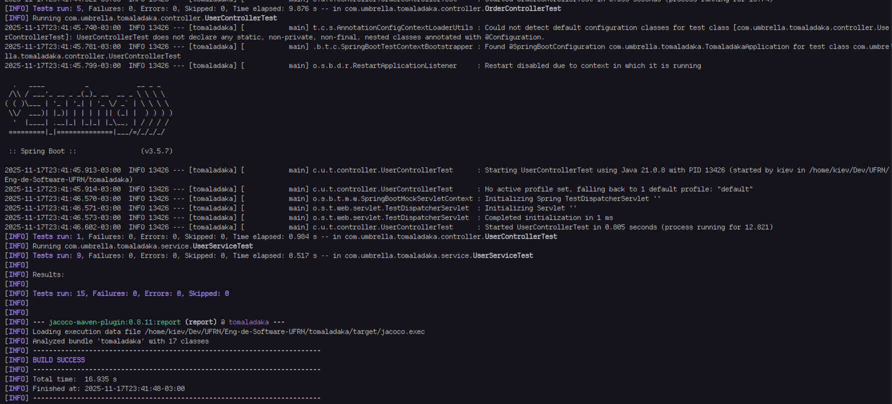

# Relatório dos testes

Fizemos testes para os Controllers de Order e User e para o Service de User. No entanto, este relatório tratará apenas dos testes de UserService.

Utilizamos o comando `mvn test` para executar os teste. Utilizamos também o JaCoCo para gerar um relatório de cobertura dos testes.


## Resultado dos testes de cobertura



Na imagem acima gerada pelo JaCoCO, vemos que 100% de todas as instruções da classe **UserService** foram atingidas pelos testes em `UserServiceTest.java`. 

Já no que se refere a branches, a maioria dos métodos não tinham branches, só updateUser, que possui 4, sendo 2 por cada *if*.

```java
public User updateUser(Long id, User userDetails) {
    User existingUser = getUserById(id);

    if (userDetails.getName() != null) {
        existingUser.setName(userDetails.getName());
    }
    if (userDetails.getEmail() != null) {
        existingUser.setEmail(userDetails.getEmail());
    }

    return userRepo.save(existingUser);
}
```

Assim, para passar por todas as 4 branches, criamos 4 testes para o update:

```java
@Test
    void updateUser_shouldModifyAndSave() {
        User existing = User.builder().id(1L).name("Prof").email("prof@ufrn.com").build();
        User details = User.builder().name("Prof2").email("prof2@ufrn.com").build();

        when(userRepo.findById(1L)).thenReturn(Optional.of(existing));
        when(userRepo.save(any(User.class))).thenAnswer(invocation -> invocation.getArgument(0));

        User updated = userService.updateUser(1L, details);

        assertEquals("Prof2", updated.getName());
        assertEquals("prof2@ufrn.com", updated.getEmail());
        verify(userRepo, times(1)).save(existing);
    }

@Test
void updateUser_shouldUpdateOnlyNameWhenEmailNull() {
    User existing = User.builder().id(1L).name("aluno").email("aluno@ufrn.com").build();
    User details = User.builder().name("aluno2").build();

    when(userRepo.findById(1L)).thenReturn(Optional.of(existing));
    when(userRepo.save(any(User.class))).thenAnswer(invocation -> invocation.getArgument(0));

    User updated = userService.updateUser(1L, details);

    assertEquals("aluno2", updated.getName());
    assertEquals("aluno@ufrn.com", updated.getEmail());
    verify(userRepo, times(1)).save(existing);
}

@Test
void updateUser_shouldUpdateOnlyEmailWhenNameNull() {
    User existing = User.builder().id(1L).name("prof").email("prof@ufrn.com").build();
    User details = User.builder().email("prof2@ufrn.com").build();

    when(userRepo.findById(1L)).thenReturn(Optional.of(existing));
    when(userRepo.save(any(User.class))).thenAnswer(invocation -> invocation.getArgument(0));

    User updated = userService.updateUser(1L, details);

    assertEquals("prof", updated.getName());
    assertEquals("prof2@ufrn.com", updated.getEmail());
    verify(userRepo, times(1)).save(existing);
}

@Test
void updateUser_shouldNotChangeWhenDetailsFieldsAreNull() {
    User existing = User.builder().id(1L).name("prof").email("prof@ufrn.com").build();
    User details = User.builder().build();

    when(userRepo.findById(1L)).thenReturn(Optional.of(existing));
    when(userRepo.save(any(User.class))).thenAnswer(invocation -> invocation.getArgument(0));

    User updated = userService.updateUser(1L, details);

    assertEquals("prof", updated.getName());
    assertEquals("prof@ufrn.com", updated.getEmail());
    verify(userRepo, times(1)).save(existing);
}
```

Sendo assim, como mostrado no JaCoCo, a nossa classe possui 100% de cobertura nos testes, tanto em instruções quanto em branches.

## Explicação por teste

- `createUser_shouldSaveAndReturnUser`: Neste teste, é criado um usuário e depois a criação e verificada com o retorno.
- `getUserById_shouldReturnUser_whenFound`: Neste teste, um usuário é buscado por ID e é verificado que o usuário é encontrado e retornado.
- `getUserById_shouldThrow_whenNotFound`: Verifica-se que quando um usuário não é encontrado numa busca por ID, o erro **IllegalArgumentException** é levantado.
- `getAllUsers_shouldReturnList`: É verificado que o método de listagem de usuários retorna uma lista com os 2 usuários criados.
- `updateUser_shouldModifyAndSave`: É verificado que um usuário é modificado com os dois campos (name e email).
- `deleteUser_shouldCallDeleteOnRepo`: É verificado que o método delete é chamado uma vez no repository quando solicitada a exclusão de um User.
- `updateUser_shouldUpdateOnlyNameWhenEmailNull`: É verificado que apenas o name é alterado quando solicitado apenas esse campo no update do service.
- `updateUser_shouldUpdateOnlyEmailWhenNameNull`: Mesma coisa que o de cima, mas para email.
- `updateUser_shouldNotChangeWhenDetailsFieldsAreNull`: Verifica-se que nada muda quando passamos argumentos nulos para o update do User.

## Resultado no terminal

Abaixo está o print do terminal com os 15 testes executados, contando com os 9 de UserService.

